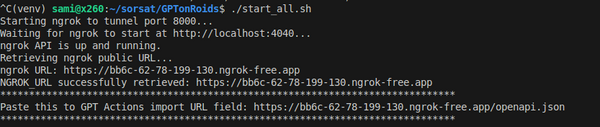
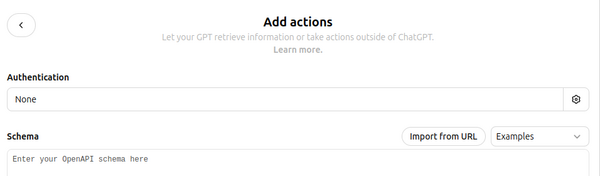
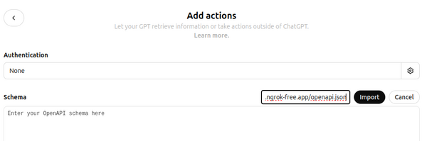

# GPTonRoids

GPTonRoids is a powerful and flexible application that bridges the capabilities of ChatGPT with your local environment and various third-party services through GPT Actions. By leveraging FastAPI and a suite of custom endpoints, GPTonRoids enables seamless interaction between natural language commands and system-level operations, enhancing productivity and extending the functionality of ChatGPT for specific use cases.

## Table of Contents
- [Features](#features)
- [How It Works](#how-it-works)
- [Setup](#setup)
- [Usage](#usage)
- [API Documentation](#api-documentation)
- [Environment Variables](#environment-variables)
- [Security](#security)
- [Testing](#testing)
- [Contributing](#contributing)
- [License](#license)

## Features

GPTonRoids offers a comprehensive set of features that allow users to interact with their local system and third-party services using natural language through ChatGPT:

### File Management:
- Create, read, update, and delete files and directories.
- Append content or lines to existing files.
- Search for files by name or content.
- Retrieve file metadata.

### Command Execution:
- Run predefined safe commands (e.g., `ls`, `pwd`, `echo`) with a secure whitelist mechanism.

### GitHub Integration:
- Fetch repository information and issues.
- Create new GitHub issues directly from ChatGPT.

### Text-to-Speech:
- Convert text input into WAV audio files and play them in the background.

### Screenshot Capture:
- Capture screenshots of the local machine and retrieve the file path.

### API Extensions:
- Easily extendable with additional endpoints to integrate more services and functionalities.

### Ngrok Integration:
- Expose the local FastAPI server to the internet securely using ngrok, enabling remote access and integration with GPT Actions.

## How It Works

GPTonRoids leverages GPT Actions, a feature that allows ChatGPT to perform API calls based on natural language inputs. Here's an overview of the architecture and workflow:

### FastAPI Server:
- Serves as the backend, providing various RESTful API endpoints that perform system operations and interact with third-party services.
- Implements security measures using API keys to ensure that only authorized requests are processed.

### GPT Actions:
- Custom GPTs are configured to use GPT Actions by defining the necessary API schemas and authentication.
- When a user interacts with ChatGPT using natural language, GPT Actions translate these inputs into corresponding API calls to GPTonRoids.

### Ngrok Tunneling:
- Ngrok is used to create a secure tunnel to the local FastAPI server, making it accessible over the internet.
- This allows GPT Actions to communicate with GPTonRoids regardless of the server's local environment.

### Environment Management:
- Environment variables are managed through a `.env` file, storing sensitive information like API keys and tokens securely.

## Setup

1. **Clone the Repository:**
   ```bash
   git clone https://github.com/yourusername/GPTonRoids.git
   cd GPTonRoids
   ```

2. **Create and Activate a Virtual Environment:**
   ```bash
   python3 -m venv venv
   source venv/bin/activate
   ```

3. **Install Dependencies:**
   ```bash
   pip install -r requirements.txt
   ```

4. **Configure Environment Variables:**
   - Copy the example file:
     ```bash
     cp .env.example .env
     ```
   - Edit .env to set:
      - `GPTONROIDS_API_KEY`: Your API key for securing the GPTonRoids API.
      - `GITHUB_TOKEN`: Your personal GitHub access token (with necessary permissions).
      - `WORK_DIR` (Optional): Defaults to <project_root>/work if not set.
      - `SAFE_COMMANDS` (Optional): Comma-separated list of allowed commands for the run-command endpoint. Defaults to ls,pwd,uname,echo,cat,hostname,git.

5. **Start the Application:**
   ```bash
   ./start_all.sh
   ```



6. **Edit your GPT:**
- Add actions, Import from URL



7. **Paste your OpenAPI URL and Import:**



8. **Set Authentication API Key, Custom Header Name and your API key defined in `.env`:**


## Environment Variables

GPTonRoids uses environment variables for configuration, managed through a .env file for ease of setup and security. Below are the environment variables used by GPTonRoids:

GPTONROIDS_API_KEY: Required. API key to secure access to the GPTonRoids API endpoints. Choose a strong, secret key.
GITHUB_TOKEN: Required. Your personal GitHub access token with the necessary permissions.
WORK_DIR (Optional): Defaults to <project_root>/work if not set.
SAFE_COMMANDS (Optional): Comma-separated list of allowed commands for the run-command endpoint. Defaults to ls,pwd,uname,echo,cat,hostname,git.
PORT_TO_TUNNEL: Port for ngrok to tunnel (default: 8000).

## API Documentation

Once the server is running, navigate to `http://localhost:8000/docs` to access the interactive API documentation provided by FastAPI's Swagger UI.

## Security Recommendations

- **Protect Your API Key:** Ensure that the `GPTONROIDS_API_KEY` is kept secret and not exposed in version control systems.
- **Limit GitHub Token Permissions:** The `GITHUB_TOKEN` should have the minimal required permissions to perform necessary actions.

## License

MIT

